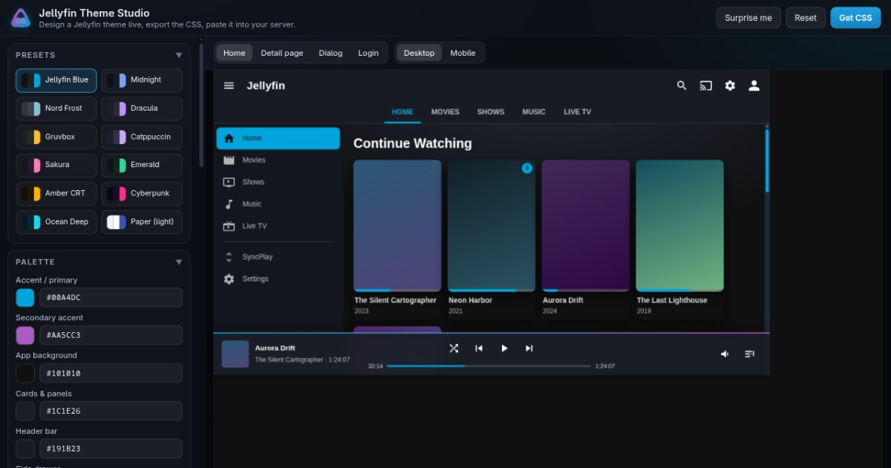
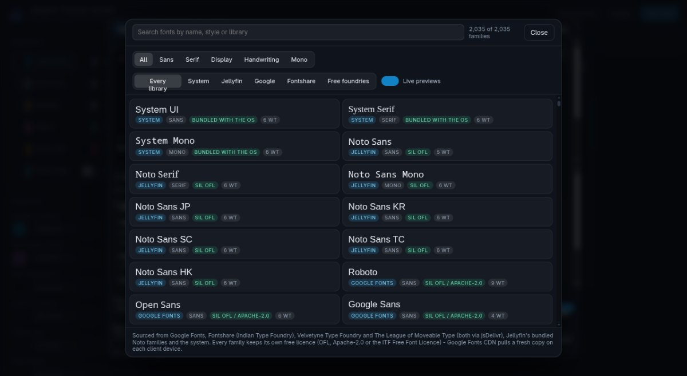
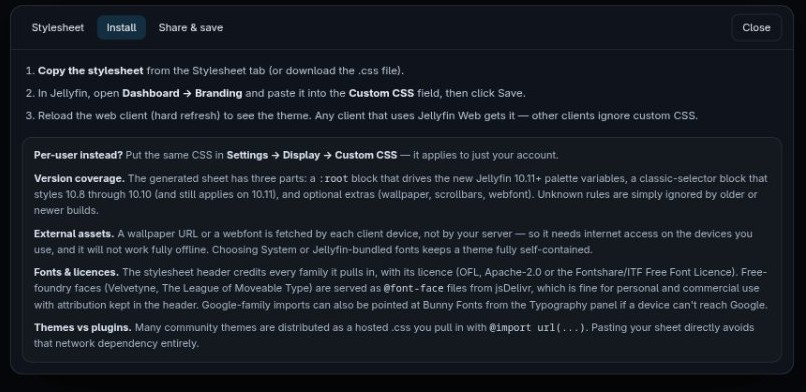

<div align="center">
  
  <h1>Jellyfin Theme Studio</h1>
  <p><b>Design a Jellyfin theme in your browser — then paste the generated CSS into your server.</b></p>
  <p>
    <a href="LICENSE"></a>
    
    
    
  </p>
  
</div>

---

A visual theme designer for [Jellyfin](https://jellyfin.org). Tune colours, surfaces, the
header, cards, wallpaper, effects and typography while a faithful, **isolated Jellyfin Web
mock-up** updates live next to you — then export a single, paste-ready stylesheet.

It targets both generations of Jellyfin styling: the new **10.11+ palette variables**
(`--jf-palette-*` inside `:root`) **and** the classic 10.8–10.10 selectors, in one file. No
plugins, no theme repository, no server access required: *Dashboard → Branding → Custom CSS*,
paste, save.

**Try it without cloning anything:** <https://stradios.github.io/Jellyfin-Theme-Studio/> — 
or the self-hosted copy of the same file at <https://github.com/Stradios/Jellyfin-Theme-Studio#quick-start>.
.

<p align="center">
  
  
</p>

## Features

**Live preview**

- Four screens (**Home**, **Detail page**, **Dialog**, **Login**) in two device frames
  (**Desktop 1280×800**, **Mobile 430×860**), rendered with real Jellyfin Web class names so
  the preview reacts the same way your server will.
- The mock lives in its own same-origin iframe with its own `<style>` element — the studio's
  own UI can never leak into the theme, and the theme can never leak into the studio.
- Preview is camera-scaled to fit, so any window size shows the whole device.

**Theme controls**

- **12 built-in presets** (Jellyfin Blue, Midnight, Nord Frost, Dracula, Gruvbox, Catppuccin,
  Sakura, Emerald, Amber CRT, Cyberpunk, Ocean Deep, Paper) plus a **“Surprise me”** randomiser
  that keeps the result coherent.
- Palette: app background, surfaces/cards, header, side drawer, text, secondary text, accent
  and secondary accent, dividers, scrollbar, plus automatic hover/soft/dark variants.
  Every colour row has a swatch picker **and** a hex field.
- Header modes (solid / gradient / transparent), optional blur/glass surfaces, glow strength,
  corner radius, UI radius, drop shadows, card hover effects (lift, glow, zoom, border).
- Wallpaper: any image URL, with blur, darkening, opacity and a “film grain/overlay” option —
  or paste a sample URL to try one instantly.
- Typography: body, heading and monospace families, body/heading weights, a modular heading
  scale (h1 = r³, h2 = r², h3 = r), base size, line height, letter spacing, uppercase titles,
  tabular numbers and font smoothing.
- Extras: page scroll-to-top button, themed scrollbars, backdrop treatment, “now playing” bar,
  login screen, dialog styling and more.

**Fonts**

- **2,035 families** in the picker: the OS stack, the 8 Noto faces Jellyfin already bundles
  (no download at all), **1,938 Google Fonts**, 64 Fontshare/ITF faces and the Velvetyne +
  League of Moveable Type collections.
- Search, category tabs (sans/serif/display/handwriting/mono), library tabs, licence badges,
  available-weight badges and a **Live previews** toggle so you can render a page without
  pulling in hundreds of webfonts.
- Weight sliders are clamped to the weights a family actually ships, variable fonts are
  requested as a single `wght@min..max` axis, and only the weights you use are imported.
- Fonts are loaded from the **official** sources (Google Fonts, Fontshare, jsDelivr). The
  exported stylesheet credits every family it pulls in, with its licence (OFL, Apache-2.0, or
  the Fontshare/ITF Free Font Licence), so attribution travels with the CSS.
- Google families can be pointed at **Bunny Fonts** instead of Google in one click, or avoided
  entirely by choosing the System/Jellyfin-bundled stacks — useful for offline or GDPR-minded
  setups.

**Export & sharing**

- **Stylesheet** tab: the full CSS (optionally minified), one-click copy, or download as
  `.css`. Named themes are saved to `localStorage` (last 20) so you can come back to them.
- **Install** tab: exactly where the CSS goes in Jellyfin, and what each part of the generated
  file does.
- **Share & save** tab: a permalink that encodes the entire theme in the URL hash
  (`#t=…` base64) — pasting it into a chat or an issue reproduces the design exactly.
- Live **contrast checking**: every text/background pair shows its WCAG ratio and grade
  (AAA/AA/AA Large/icons only) with a warning when something would be unreadable.

## Quick start

The site is a single static `index.html`. There is **no build step to run it** and no
dependencies at runtime.

```bash
# clone and open it
git clone https://github.com/Stradios/Jellyfin-Theme-Studio.git
cd Jellyfin-Theme-Studio
python3 -m http.server 8080     # or: npx serve .
# → http://localhost:8080/
```

Opening `index.html` straight from disk (`file://`) also works in most browsers, but a tiny
static server is more reliable for fonts and clipboard permissions.

### Deploy it on GitHub Pages

1. Fork or clone this repository (or push the whole folder to your own repo's `main` branch).
2. **Settings → Pages → Build and deployment → Source: _Deploy from a branch_**, branch
   `main`, folder **/ (root)**. Save.
3. A minute later your studio is live at `https://<your-user>.github.io/<your-repo>/` — for
   this repository that is <https://stradios.github.io/Jellyfin-Theme-Studio/>.

Nothing else is needed for this route: the root `index.html` is already the built site and
there are no relative asset dependencies other than the screenshots in `assets/`.

**Heads-up on dotfiles:** `.nojekyll`, `.gitignore` and `.github/workflows/pages.yml` start
with a dot, so some archive extractors and drag-and-drop uploads silently drop them. If you
re-create the repository by hand, add them explicitly — the Actions route below does nothing
without `pages.yml`.

<details>
<summary><b>Optional: rebuild on every push with GitHub Actions</b></summary>

The workflow in `.github/workflows/pages.yml` regenerates the site from the generator source
(`perchance/`) and deploys it. To use it, set **Settings → Pages → Source: _GitHub Actions_**.
If you prefer the branch deployment above, just delete `.github/`.

Note that the workflow overwrites the deployed copy of `index.html` from `perchance/`, so the
committed root `index.html` is a convenience snapshot for the branch-deployment route; keep
them in sync by running `node build.mjs` before committing.
</details>

### Put the theme on your server

1. In the studio, hit **Get CSS** and copy the stylesheet (or download the `.css`).
2. In Jellyfin: **Dashboard → Branding → Custom CSS** → paste → **Save**.
   *Per-user instead?* **Settings → Display → Custom CSS** applies it to just your account.
3. Hard-refresh the web client. Every user of that server who loads Jellyfin Web picks the
   theme up; other clients (mobile apps, TVs) ignore custom CSS by design.
4. Reload after changing the theme — Jellyfin caches the stylesheet.

## Repository layout

```
index.html              the site — generated from perchance/ by build.mjs (do not hand-edit)
build.mjs               node script: rebuilds index.html from the generator source
build-site.mjs          the pure transform used by build.mjs (no dependencies)
perchance/
  index.html            the generator's markup + the whole application (source of truth)
  main.pjs              the generator's metadata (title, description, tags, social image)
assets/
  icon.svg              the app icon (also inlined as the favicon)
  screenshot.jpg        hero image for this README
  font-picker.jpg       screenshot: the font library
  export-install.jpg    screenshot: the export dialog
.nojekyll               tells Pages to serve the files as-is instead of running Jekyll
.gitignore              node/OS leftovers
.github/workflows/
  pages.yml             optional: rebuild + deploy to GitHub Pages on push
```

`index.html` is a build artifact: the app itself lives in `perchance/index.html`, where the
header still uses the generator's `[title]` / `[subtitle]` placeholders. `build.mjs` fills
those in and wraps the body in a complete document with `<title>`, meta description, Open
Graph/Twitter cards and an inline SVG favicon.

```bash
node build.mjs                       # reads perchance/, writes ./index.html
node build.mjs perchance _site       # or pick your own source/output
```

If someone edits the logo in `perchance/index.html` without updating `assets/icon.svg`,
the build **fails with an explanatory error** instead of silently shipping a stale favicon.

The social-card image (`og:image` / `twitter:image`) is taken from the `image` key in
`perchance/main.pjs`, which currently points at a hosted screenshot so that the card works
even before Pages is enabled. For link previews on your own deployment, set it to an absolute
URL of your copy, e.g.
`https://stradios.github.io/Jellyfin-Theme-Studio/assets/screenshot.jpg`.

## How it works

- **One HTML file, vanilla JS.** `perchance/index.html` holds the markup, the studio chrome
  CSS, the font-library data and the application script. No framework, no bundler, no
  runtime dependencies — which is also why the whole thing works from a plain static host.
- **One `buildCss(o)` for everything.** The same function feeds the live preview and the
  export, so what you see is literally what you copy. It emits three parts: `:root` palette
  variables (Jellyfin 10.11+), a classic selector block (10.8–10.10, still valid on 10.11)
  and optional extras (wallpaper, scrollbars, glows, hover effects).
- **A real mock, not a picture.** The preview iframe is written with `document.write` using
  the same class names Jellyfin Web uses (`.cardBox`, `.detailPagePrimaryContainer`,
  `.emby-button`, …), including a header, drawer, poster grid, playback bar, dialogs and the
  login screen, so theme rules are exercised exactly as they will be in production.
- **Contrast math is local.** WCAG relative luminance and ratios are computed in-page, per
  colour pair, with no external library.
- **Sharing is stateless.** A theme is a JSON object; `encodeState()` base64-encodes it into
  the URL hash. There is no backend, no account, and nothing to expire.

## Privacy

- 100% client-side. No analytics, no cookies, no accounts, no server component of any kind.
- Saved themes and the current state live in your browser's `localStorage` only.
- The only network requests the app makes are the font stylesheets you select (Google Fonts,
  Fontshare or jsDelivr) and, if you configure one, the wallpaper image **for the preview**.
  The exported CSS only references fonts and wallpapers — your Jellyfin clients fetch those,
  not your server.
- Nothing about your server, users or library ever leaves the page.

## Browser support

Any current Chromium, Firefox or Safari (desktop or mobile). The app uses
`document.write` for the preview iframe, `ResizeObserver` for fit-to-pane scaling and
CSS custom properties throughout. It works in in-app browsers too — no service worker, no
module bundling, no special headers needed.

## Roadmap / ideas

- More preview screens (library grid, admin dashboard, music player, live TV guide).
- Export/import theme JSON, and a share-link QR code.
- Per-element overrides (a "click the preview to select the element" inspector).
- Optional generator for [Jellyfin
  theming plugins](https://github.com/danieladov/jellyfin-plugin-skin-manager)-style JSON.
- Side-by-side theme comparison and A/B toggling.

Issues and PRs are welcome — especially **preset contributions** (a named palette + options
object) and **selector fixes** for Jellyfin versions that changed their markup.

## Contributing

1. Fork, then edit `perchance/index.html` (that is the source of truth).
2. If you touched the logo, update `assets/icon.svg` to match.
3. Run `node build.mjs` so the committed `index.html` is up to date.
4. Open a PR describing what changed and, if it is a visual change, with screenshots.

## Licence & trademark

The code in this repository is released under the **MIT Licence** — see [LICENSE](LICENSE).
Replace the copyright holder line with your own name or handle if you fork it.

**This is an unofficial, community project.** “Jellyfin” and the Jellyfin logo are the
property of the Jellyfin project; this studio is not affiliated with, endorsed by, or
supported by them. The icon shipped here is an original mark drawn for this tool (a
reinterpretation of the Jellyfin delta, with a jelly-like wobble and a liquid “theme level”
inside it) and is not the official Jellyfin logo; if the Jellyfin project asks for a change,
it will be changed.

Fonts are **not** redistributed here: the app links to Google Fonts, Fontshare and jsDelivr,
and each family stays under its own licence (OFL, Apache-2.0, or the Fontshare/ITF Free Font
Licence). The exported stylesheet credits every family it uses so you can keep attribution
intact.

## Credits

- [Jellyfin](https://jellyfin.org) — the media server, and the class names the preview mocks.
- [Google Fonts](https://fonts.google.com), [Fontshare](https://fontshare.com) (Indian Type
  Foundry), [Velvetyne](https://velvetyne.fr), [The League of Moveable Type](https://www.theleagueofmoveabletype.com)
  and [Bunny Fonts](https://fonts.bunny.net) for the type.
- Every preset palette belongs to its community: Nord, Dracula, Gruvbox, Catppuccin and
  friends — thanks for the colours.